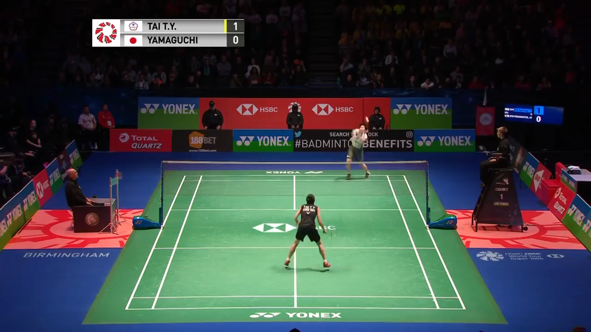

# Badminton Court Detection
[](https://opensource.org/licenses/BSD-3-Clause)

Fully automatic algorithm for badminton court line detection. Implementation based on Farin
D. et al. "Robust Camera Calibration for Sports Videos using Court Models", *Storage and
Retrieval Methods and Applications for Multimedia 2004*, 2003. 



# Installation instructions

```
mkdir build && cd build
cmake ..
make
```
Note: A video streaming codec is required to be installed for the executable to read videos. We suggest `libgstreamer` or `ffmpeg`.

# Usage

The detection algorithm is started for the middle frame of the input video file (in avi
format).

```
Usage: ./build/bin/detect video_path [output_path]
       video_path:  path to an input avi file.
       output_path: path to an output file where the xy court point coordinates will be written.
                    This argument is optional. If not present, then a window with the result will be opened.
```

## Output file

The output file contains one point per line. The XY coordinates are separated by a
semicolon ";".  The points are in the following order:

```
1.  Intersection of the lower base line with the left side line
2.  Intersection of the lower base line with the right side line
3.  Intersection of the upper base line with the left side line
4.  Intersection of the upper base line with the right side line
5.  Intersection of the left netpole with the top of the net
6.  Intersection of the right netpole with the top of the net
```

## Known issues

- (073021) When compiling on arch linux (x86_64 gcc 11.1), libtiff defaults to static
library build. Passing in
```
[options]
Shared=True
```
to conanfile does not work). However, the error seems to just be missing these two files:
`/usr/lib/libjpeg.a` and `/usr/lib/libturbojpeg.a`. A hack around this issue is to symlink the so
version of the two libraries to the static ones, and that somehow tricked the compiler and conan. It
builds everything fine afterwards, and it seems that the runtime does not use those either so runs
fine.

## Acknowledgements

Original implementation based on the code of [Grzegorz Chlebus](https://github.com/gchlebus/tennis-court-detection.git).